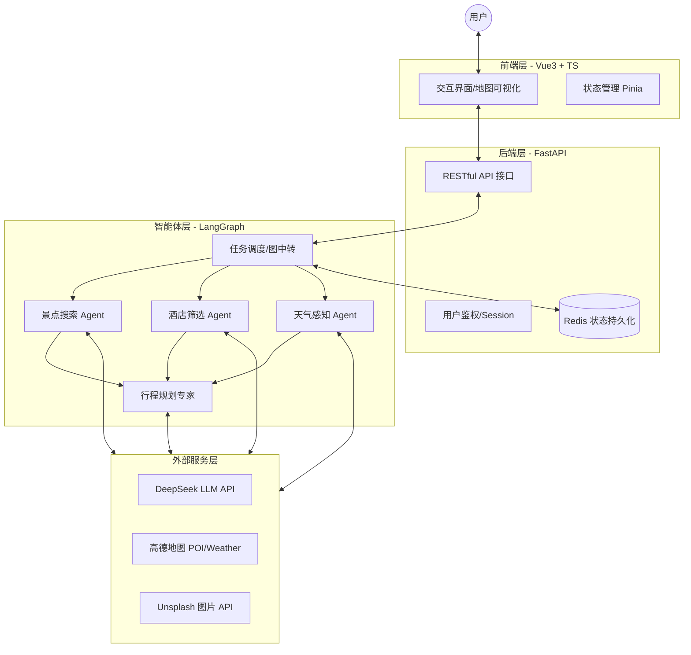

# 智能旅行助手 (My Travel Assistant) 系统架构设计

本系统旨在通过大语言模型（LLM）与实时地理数据服务（高德地图）深度集成，为用户提供一站式、可落地的旅行规划服务。

## 1. 总体架构图 (C4 Model 视角)

## 2. 各层功能详解

### (1) 前端层 (Vue3 + TypeScript)
*   **核心功能**：
    *   **动态表单**：采集城市、日期、偏好、预算等核心参数。
    *   **流式响应渲染**：实时显示 Agent 的思考过程与中间结果。
    *   **地图集成 (AMap JS API)**：在地图上打点展示景点与酒店的地理位置，生成路线规划轨迹。
    *   **导出模块**：支持将生成的 Trip Plan 导出为 PDF 或高清图片。

### (2) 后端层 (FastAPI)
*   **核心功能**：
    *   **API 路由**：封装 LangGraph 的交互接口。
    *   **并发控制**：利用 Python 异步特性（AsyncIO）支撑高并发请求。
    *   **持久化管理**：对接 PostgreSQL 或 Redis，利用 LangGraph 的 `Checkpointer` 功能实现对话中断重连。
    *   **安全防御**：API Key 隐藏、请求频率限制（Rate Limiting）。

### (3) 智能体层 (HelloAgents / LangGraph)
*   **核心逻辑**：基于现有 `src/agent/graph.py` 构建。
*   **分工设计**：
    *   **景点搜索 Agent**：利用 LLM 提取语义关键词，调用高德 POI 接口，召回 Top 5 匹配景点。
    *   **酒店筛选 Agent**：根据用户的预算等级（经济/高档），筛选地理位置优越的住宿建议。
    *   **天气感知 Agent**：获取目的地未来 3-7 天天气，为行程的“室内/室外”安排提供决策依据。
    *   **行程规划专家**：整合上述三个 Agent 的数据，进行时间轴排布，确保行程逻辑闭环。

### (4) 外部服务层
*   **DeepSeek API**：提供核心推理能力，负责语义理解与最终计划的文本润色。
*   **高德地图 API**：提供真实世界的地理坐标、行政区划代码及实时天气。
*   **Unsplash API**：根据景点名称检索高质量图片，提升视觉体验。

## 3. 部署方案建议
*   **容器化**：使用 Docker Compose 同时部署前端 Nginx、后端 FastAPI、Redis 缓存。
*   **云原生**：推荐部署在支持 WebSockets/Server-Sent Events (SSE) 的环境，以支持 Agent 的流式输出。
